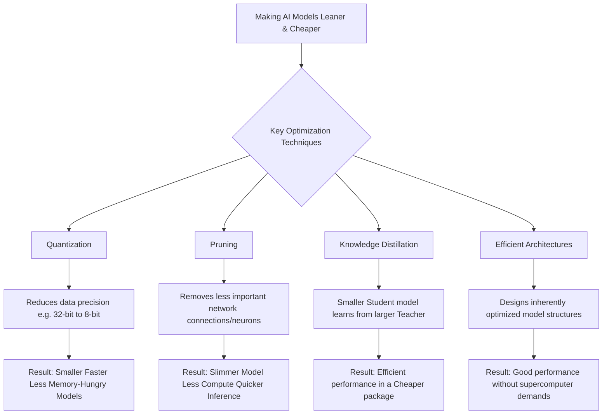
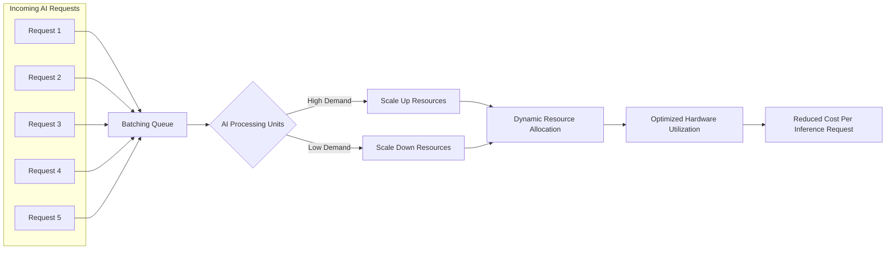
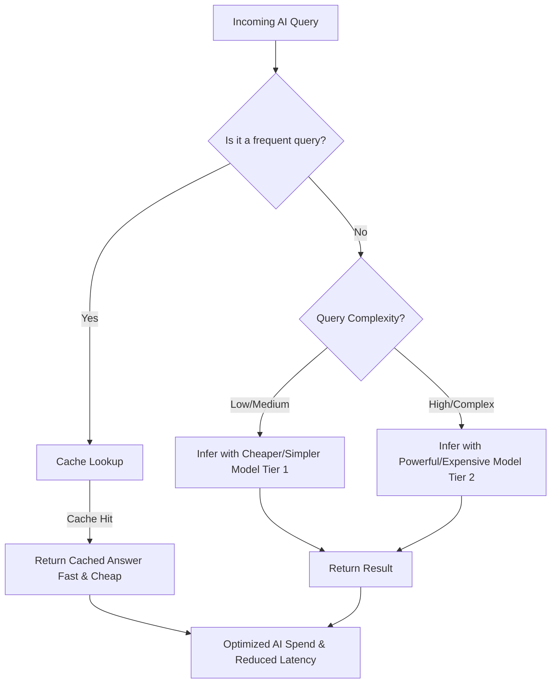

The cost of AI is going up. Not just for training models—inference costs are climbing too. Right now, most companies are absorbing these costs or relying on engineers to optimize prompts and architectures. That's not sustainable.

Looking ahead, controlling AI spend will require a mix of regulatory pressure, technological innovation, and operational discipline. Here's what I'm watching.

## The Regulatory Gauntlet: Who Pays for "Safe AI"?

Governments are stepping in. The EU has the AI Act, various U.S. states are pushing their own rules, and more is coming. These regulations require risk assessments, transparency reports, and safeguards against discrimination.

The cost? Estimates say compliance could add billions to AI development and operational budgets. It's a "safety tax" on AI companies, and someone has to pay for it.

One interesting idea: use computational cost to determine regulatory scrutiny instead of revenue. Companies training massive models face stricter rules; smaller operations get lighter oversight. Makes sense—compute footprint correlates with potential impact.

## Tech to the Rescue: Smarter AI, Cheaper Inference

Technology will always be the biggest lever for cost reduction. Here's what's working now and what's coming.

### Making Models Leaner and Meaner

**Quantization** reduces precision (32-bit to 8-bit) to shrink models. Smaller size, faster inference, lower memory use. Minimal accuracy loss if done right.

**Pruning** removes less important connections in neural networks. You end up with a slimmer model that runs faster and costs less per inference.

**Knowledge Distillation** trains a smaller "student" model to mimic a larger "teacher" model. The student performs comparably but runs on cheaper hardware.

**Efficient Architectures** are models designed from the ground up to be lean. Smaller open-source models are proving you don't need a supercomputer for good performance.

### Prompt Engineering Gets Even Smarter

Concise prompts save tokens. Fewer tokens mean lower costs. Future engineers will treat prompt optimization like query optimization in databases—every unnecessary word costs money.

### Specialized Hardware and Edge Computing

**Specialized Hardware** like GPUs, TPUs, and edge AI chips are purpose-built for inference. They're more power-efficient than general-purpose CPUs and reduce inference time and cost.

**Edge Computing** processes data locally—on your phone, in your car, at the sensor. Less reliance on centralized cloud infrastructure means lower costs and better privacy.

## Operational Savvy: Running AI Like a Well-Oiled (and Cheap) Machine

How you deploy and manage AI matters as much as the technology itself.

### Batching and Scaling

**Batching** groups multiple inference requests together. Process them simultaneously to maximize hardware utilization and reduce cost per request.

**Dynamic Scaling** adjusts resources based on demand. Orchestration tools spin up capacity when traffic spikes and shut it down during quiet periods. You only pay for what you use.

### Serverless Inference

Cloud providers now offer serverless AI inference. You pay only for compute time when your model is actually running. Perfect for unpredictable workloads. No idle resource costs.

### Caching and Tiering

**Caching** remembers answers to common questions. If someone asks again, serve the cached response instead of running inference. Huge cost savings for repetitive queries.

**Model Tiering** routes queries to the right model. Simple questions go to cheap, fast models. Complex questions go to expensive, powerful models. Don't use a sledgehammer when a regular hammer works.

### FinOps for AI

Financial Operations (FinOps) for AI means tracking and managing AI spend like you would cloud infrastructure. Use platforms to monitor costs across models and services. Set budgets. Enforce policies. Make AI spend visible and controllable.

## The Path Forward

Controlling AI costs isn't one thing—it's everything. Regulatory compliance will add overhead. Technology will make inference cheaper. Operations will determine whether you're running efficiently or burning cash.

The companies that figure this out will be the ones still deploying AI at scale in five years. The rest will be priced out or regulated into irrelevance.

Worth paying attention to.
