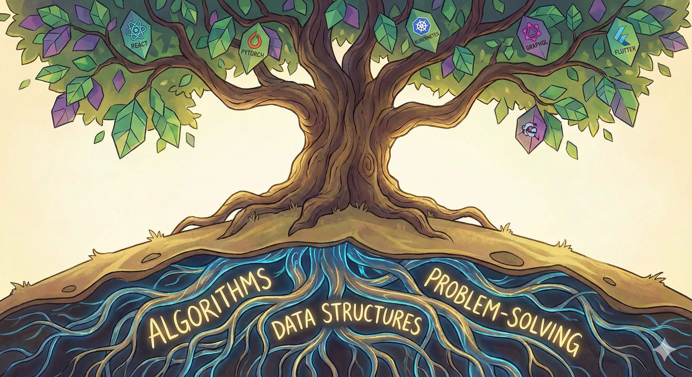

Let's be honest, the pace of innovation isn't just fast—it feels like it's accelerating, and it's not going to slow down. There will *always* be a "next big thing" right around the corner, promising to change everything. It's enough to make anyone feel like they're constantly falling behind.

## It's a Marathon, Not a Sprint

If you're feeling that pressure, maybe it's time to change your relationship with the hype cycle. Instead of treating our careers like a series of frantic sprints toward the newest trend, we need to start seeing them for what they are: a marathon.

A marathon runner doesn't burn all their energy trying to keep up with every person who sprints past them at the start. They find a sustainable pace because they know the race is long. For us in tech, finding that pace is the key to avoiding burnout and building a career with real staying power.

## Finding Your Sustainable Pace

So, what does a sustainable pace look like? It means being intentional. It means focusing on durable skills—the fundamentals that will serve you no matter what new framework drops next year.

Your value isn't measured by how many new AI libraries you can list on your resume. It's measured by the quality of your work, your core problem-solving ability, and your capacity to learn and adapt *at a pace that works for you*. It's about solving real problems with the tools that make sense, not just the ones that are trending.

It is absolutely okay to let some trends pass you by. Your sanity is worth so much more than being on the bleeding edge of everything, all the time.

